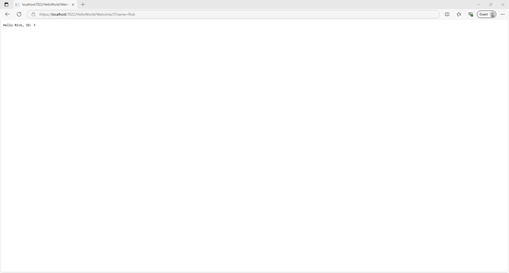
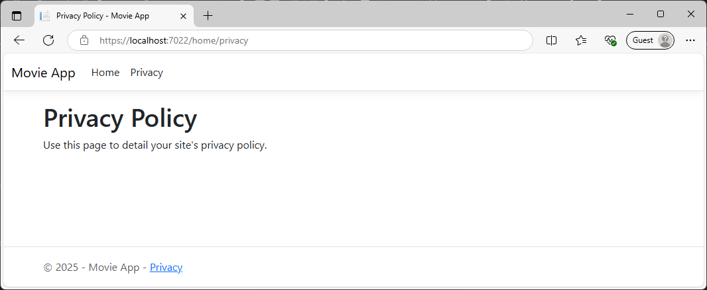
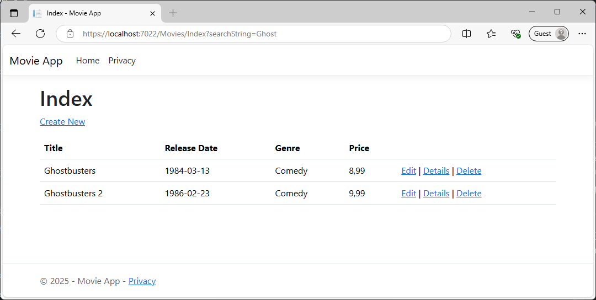

# CI-CD_w_ISS_Windows-server


### 1. Start setting up ASP.NET Core MVC

1. Oppen Visual Studio (BE SURE YOU HAVE WITH: ASP.NET and web development workload.)
2. Create the web app
3. Create new project.
4. Choose ASP.NET Core Web App (Model-View-Controller) > Next.
5. Enter MvcMovie for Project name.
6. When code created - run program
7. Select Yes if you trust the IIS Express SSL certificate.
8. Select Yes if you agree to trust the development certificate.


The following image shows first run:


---

### 2. Add it to github

1. `echo "# CI-CD_w_ISS_Windows-server" >> README.md`
2. `git init`
3. `dotnet new gitignore`
4. `git add .`
5. `git commit -m "first commit"`
6. `git branch -M main`
7. `git remote add origin https://github.com/WANTEDSIMON/CI-CD_w_ISS_Windows-server.git`
8. `git push -u origin main`

---

### 3. Adding a controller to the ASP.NET Core MVC app

1. In Solution Explorer, right-click Controllers > Add > Controller.
2. In the Add New Scaffolded Item dialog box, select MVC Controller - Empty > Add.
3. Name the controller `HelloWorldController.cs` and select Add.
4. Replace the contents of the `HelloWorldController.cs` file:
```csharp
using Microsoft.AspNetCore.Mvc;
using System.Text.Encodings.Web;

namespace MvcMovie.Controllers;

public class HelloWorldController : Controller
{
    // 
    // GET: /HelloWorld/
    public string Index()
    {
        return "This is my default action...";
    }
    // 
    // GET: /HelloWorld/Welcome/ 
    public string Welcome()
    {
        return "This is the Welcome action method...";
    }
}
```
5. Running the program and vissit localhost:Port/helloworld

The following image shows the run:


6. Vissit then localhost:Port/helloWorld/welcome

The following image shows the result:


7. Change the Welcome method to include two parameters as shown in the following code.
```csharp
// GET: /HelloWorld/Welcome/ 
// Requires using System.Text.Encodings.Web;
public string Welcome(string name, int numTimes = 1)
{
    return HtmlEncoder.Default.Encode($"Hello {name}, NumTimes is: {numTimes}");
}
```

8. Run the app, then go to, localhost:Port/helloWorld/welcome?name=Rick&numtimes=4

The following image shows the result:
IMG:


9. Replace the Welcome method with the following code:
```csharp
public string Welcome(string name, int ID = 1)
{
    return HtmlEncoder.Default.Encode($"Hello {name}, ID: {ID}");
}
```

10. Run the app, then go to, localhost:Port/helloWorld/welcome/3?name=Rick

The following image shows the result:


---

### 4. Adding a view

      
1. Currently the Index method returns a string with a message in the controller class.

   In HelloWorldController class, we replace the Index method with the following code:

```csharp

public IActionResult Index()
{
 return View();
}
```

#### Now we add in the view, 

2. Right-click on the Views folder, and then Add > New Folder and name the folder HelloWorld.
3. Right-click on the Views/HelloWorld folder, and then Add > New Item.

In the Add New Item dialog select Show All Templates.
In the Add New Item - MvcMovie dialog:

- In the search box in the upper-right, enter view
- Select Razor View - Empty
- Keep the Name box value, Index.cshtml.
- Select Add

Replacing the code in Views/HelloWorld/Index.cshtml Razor view file with: 

```CSHTML
@{
    ViewData["Title"] = "Index";
}

<h2>Index</h2>

<p>Hello from our View Template!</p>
```

4. Run the app, then go to, localhost:Port/helloWorld

The following image shows the result:


5. Change views and layout pages with Change the title, footer, and menu link in the layout file
6. Now relace content that is inside of the Views/Shared/_Layout.cshtml file

First we replace:
```CSHTML
<title>@ViewData["Title"] - MvcMovie</title>
```

With:
```CSHTML
<title>@ViewData["Title"] - Movie App</title>
```

Secoud we replace:
```CSHTML
<a class="navbar-brand" asp-area="" asp-controller="Home" asp-action="Index">MvcMovie</a>
```

With:
```CSHTML
<a class="navbar-brand" asp-area="" asp-controller="Movies" asp-action="Index">Movie App</a>
```

Third we replace:
```CSHTML
&copy; 2025 - MvcMovie - <a asp-area="" asp-controller="Home" asp-action="Privacy">Privacy</a>
```

With:
```CSHTML
&copy; 2025 - Movie App - <a asp-area="" asp-controller="Home" asp-action="Privacy">Privacy</a>
```

7. Run the app, then go to, localhost:Port/home/privacy

The following image shows the result:



8. Changing the title and <h2> element from / to:

From:
```CSHTML
@{
    ViewData["Title"] = "Index";
}

<h2>Index</h2>
```

To:

```CSHTML
@{
    ViewData["Title"] = "Movie List";
}

<h2>My Movie List</h2>
```

9. Run the app, then go to, localhost:Port/helloworld

The following image shows the result:


#### Passing Data from the Controller to the View

Inside yhe HelloWorldController.cs, we will change the Welcome method to add a Message and NumTimes value to the ViewData dictionary.

We replace:
```
public string Welcome(string name, int ID = 1)
{
 return HtmlEncoder.Default.Encode($"Hello {name}, ID: {ID}");
}
```

With:
```csharp
public IActionResult Welcome(string name, int numTimes = 1)
{
  ViewData["Message"] = "Hello " + name;
  ViewData["NumTimes"] = numTimes;
  return View();
}
```

Pluss guess it was time to remobe the comment from the file.

10. Createing Welcome.cshtml a Welcome view template.

Containing:
```CSHTML
@{
    ViewData["Title"] = "Welcome";
}

<h2>Welcome</h2>

<ul>
    @for (int i = 0; i < (int)ViewData["NumTimes"]!; i++)
    {
        <li>@ViewData["Message"]</li>
    }
</ul>
```

It is a simple loop that displays the message as many times as specified by the NumTimes value.

11. Run the app, then go to, localhost:Port/helloworld/welcome?name=Rick&numtimes=4

The following image shows the result:


### 5. Adding model to the ASP.NET Core MVC app

Addeding classes for managing movies in a database. These classes are the "Model" part of the MVC app. With Entity Framework Core

The used model classes created are known as "POCO classes, from Plain Old CLR Objects." -POCO classes don't have any dependency on EF Core. They only define the properties of the data to be stored in the database.

First we create the model classes then EF Core will help with creating the database.

#### Add a data model class

1. Right-click the Models folder > Add > Class. Name the file Movie.cs.
2. Next Update the Models/Movie.cs file with the following code:

```C#
using System.ComponentModel.DataAnnotations;

namespace MvcMovie.Models;

public class Movie
{
    public int Id { get; set; }
    public string? Title { get; set; }
    [DataType(DataType.Date)]
    public DateTime ReleaseDate { get; set; }
    public string? Genre { get; set; }
    public decimal Price { get; set; }
}
```

With Visual Studio it automatically installs the required packages.

#### Scaffold movie pages
Use the scaffolding tool to produce Create, Read, Update, and Delete (CRUD) pages for the movie model.

1. In Solution Explorer, right-click the Controllers folder and select Add > New Scaffolded Item.

2. In the Add New Scaffolded Item dialog:

- In the left pane, select Installed > Common > MVC.
- Select MVC Controller with views, using Entity Framework.
- Select Add.

3. Complete the Add MVC Controller with views, using Entity Framework dialog:

- In the Model class drop down, select Movie (MvcMovie.Models).
- In the Data context class row, select the + (plus) sign.
- In the Add Data Context dialog, the class name MvcMovie.Data.MvcMovieContext is generated.
- Select Add.
- In the Database provider drop down, select SQL Server.
- Views and Controller name: Keep the default.
- Select Add.

#### Initial migration

1. In the Package Manager Console (PMC), run the following commands:
```PowerShell
Add-Migration InitialCreate
```

2. Run the following command to apply the migration to the database:
```PowerShell
Update-Database
```

#### Test the app

Imgage for testing the app:


### 6. Work with a database in the ASP.NET Core MVC app

#### Seed the database

1. Create a new class named SeedData in the Models folder. Replace the generated code with the following:
```C#
using Microsoft.EntityFrameworkCore;
using Microsoft.Extensions.DependencyInjection;
using MvcMovie.Data;
using System;
using System.Linq;

namespace MvcMovie.Models;

public static class SeedData
{
    public static void Initialize(IServiceProvider serviceProvider)
    {
        using (var context = new MvcMovieContext(
            serviceProvider.GetRequiredService<
                DbContextOptions<MvcMovieContext>>()))
        {
            // Look for any movies.
            if (context.Movie.Any())
            {
                return;   // DB has been seeded
            }
            context.Movie.AddRange(
                new Movie
                {
                    Title = "When Harry Met Sally",
                    ReleaseDate = DateTime.Parse("1989-2-12"),
                    Genre = "Romantic Comedy",
                    Price = 7.99M
                },
                new Movie
                {
                    Title = "Ghostbusters ",
                    ReleaseDate = DateTime.Parse("1984-3-13"),
                    Genre = "Comedy",
                    Price = 8.99M
                },
                new Movie
                {
                    Title = "Ghostbusters 2",
                    ReleaseDate = DateTime.Parse("1986-2-23"),
                    Genre = "Comedy",
                    Price = 9.99M
                },
                new Movie
                {
                    Title = "Rio Bravo",
                    ReleaseDate = DateTime.Parse("1959-4-15"),
                    Genre = "Western",
                    Price = 3.99M
                }
            );
            context.SaveChanges();
        }
    }
}
```

#### Add the seed initializer

Update the content in Program.cs with the following code:

1. Add the following:
```C#
using MvcMovie.Models;
```
2. Add the following code:
```C#
using (var scope = app.Services.CreateScope())
{
    var services = scope.ServiceProvider;

    SeedData.Initialize(services);
}
```

Lets run the app and see the result:


### 7. Controller methods and views

Now we need to update the code make the app more interactive/nicer.

Example, the presentation isn't ideal, for example, ReleaseDate should be two words.

1. In Models/Movie.cs we add following code:
```C#
using System.ComponentModel.DataAnnotations;
using System.ComponentModel.DataAnnotations.Schema;

```

Update the code:
```C#
  [DataType(DataType.Date)]
    public DateTime ReleaseDate { get; set; }
```

To:
```C#
    [Display(Name = "Release Date")]
    [DataType(DataType.Date)]
```

Last is add, under "Genre" adn over "Price":
```C#
[Column(TypeName = "decimal(18, 2)")]
```

full code:
```C#
using System;
using System.ComponentModel.DataAnnotations;
using System.ComponentModel.DataAnnotations.Schema;

namespace MvcMovie.Models
{
    public class Movie
    {
        public int Id { get; set; }
        public string? Title { get; set; }
        
        [Display(Name = "Release Date")]
        [DataType(DataType.Date)]
        public DateTime ReleaseDate { get; set; }
        
        public string? Genre { get; set; }
        
        [Column(TypeName = "decimal(18, 2)")]
        public decimal Price { get; set; }
    }
}
```

### 8. Add search functionality

1. In the Controllers/MoviesController.cs file, add the following code to update the Index method:
```C#
public async Task<IActionResult> Index(string searchString)
{
    if (_context.Movie == null)
    {
        return Problem("Entity set 'MvcMovieContext.Movie'  is null.");
    }

    var movies = from m in _context.Movie
                select m;

    if (!String.IsNullOrEmpty(searchString))
    {
        movies = movies.Where(s => s.Title!.ToUpper().Contains(searchString.ToUpper()));
    }

    return View(await movies.ToListAsync());
}
```

Chek the result at /Movies/Index?searchString=Ghost to the URL. The filtered movies are displayed:




Open the Views/Movies/Index.cshtml file, and add the **form** as bellow:
```CSHTML
<form asp-controller="Movies" asp-action="Index">
    <p>
        <label>Title: <input type="text" name="SearchString" /></label>
        <input type="submit" value="Filter" />
    </p>
</form>
```

Under:
```CSHTML
<p>
    <a asp-action="Create">Create New</a>
</p>
```

And abow:
```CSHTML
<table class="table">
```

Save and test changes:


I filter with Ghost, it removes the text why I re added it to maby help.

In Views/Movies/Index.cshtml change:
```CSHTML
<form asp-controller="Movies" asp-action="Index">
```
To:
```CSHTML
<form asp-controller="Movies" asp-action="Index" method="get">
```

Now we can sertch with: movies?SearchString=ghost

img:


#### Add Search by genre

Add MovieGenreViewModel.cs class with following:
```C#
using Microsoft.AspNetCore.Mvc.Rendering;
using System.Collections.Generic;

namespace MvcMovie.Models;

public class MovieGenreViewModel
{
    public List<Movie>? Movies { get; set; }
    public SelectList? Genres { get; set; }
    public string? MovieGenre { get; set; }
    public string? SearchString { get; set; }
}
```

in

Replace old Index:
```C#
        // GET: Movies
        public async Task<IActionResult> Index(string searchString)
        {
            if (_context.Movie == null)
            {
                return Problem("Entity set 'MvcMovieContext.Movie'  is null.");
            }

            var movies = from m in _context.Movie
                         select m;

            if (!String.IsNullOrEmpty(searchString))
            {
                movies = movies.Where(s => s.Title!.ToUpper().Contains(searchString.ToUpper()));
            }

            return View(await movies.ToListAsync());
        }
```

With:
```C#
// GET: Movies
public async Task<IActionResult> Index(string movieGenre, string searchString)
{
    if (_context.Movie == null)
    {
        return Problem("Entity set 'MvcMovieContext.Movie'  is null.");
    }

    // Use LINQ to get list of genres.
    IQueryable<string> genreQuery = from m in _context.Movie
                                    orderby m.Genre
                                    select m.Genre;
    var movies = from m in _context.Movie
                 select m;

    if (!string.IsNullOrEmpty(searchString))
    {
        movies = movies.Where(s => s.Title!.ToUpper().Contains(searchString.ToUpper()));
    }

    if (!string.IsNullOrEmpty(movieGenre))
    {
        movies = movies.Where(x => x.Genre == movieGenre);
    }

    var movieGenreVM = new MovieGenreViewModel
    {
        Genres = new SelectList(await genreQuery.Distinct().ToListAsync()),
        Movies = await movies.ToListAsync()
    };

    return View(movieGenreVM);
}
```

#### Add search by genre to the Index view

Update the Views/Movies/Index.cshtml file with the following code:
```CSHTML
@model MvcMovie.Models.MovieGenreViewModel

@{
    ViewData["Title"] = "Index";
}

<h1>Index</h1>

<p>
    <a asp-action="Create">Create New</a>
</p>
<form asp-controller="Movies" asp-action="Index" method="get">
    <p>

        <select asp-for="MovieGenre" asp-items="Model.Genres">
            <option value="">All</option>
        </select>

        <label>Title: <input type="text" asp-for="SearchString" /></label>
        <input type="submit" value="Filter" />
    </p>
</form>

<table class="table">
    <thead>
        <tr>
            <th>
                @Html.DisplayNameFor(model => model.Movies![0].Title)
            </th>
            <th>
                @Html.DisplayNameFor(model => model.Movies![0].ReleaseDate)
            </th>
            <th>
                @Html.DisplayNameFor(model => model.Movies![0].Genre)
            </th>
            <th>
                @Html.DisplayNameFor(model => model.Movies![0].Price)
            </th>
            <th></th>
        </tr>
    </thead>
    <tbody>
        @foreach (var item in Model.Movies!)
        {
            <tr>
                <td>
                    @Html.DisplayFor(modelItem => item.Title)
                </td>
                <td>
                    @Html.DisplayFor(modelItem => item.ReleaseDate)
                </td>
                <td>
                    @Html.DisplayFor(modelItem => item.Genre)
                </td>
                <td>
                    @Html.DisplayFor(modelItem => item.Price)
                </td>
                <td>
                    <a asp-action="Edit" asp-route-id="@item.Id">Edit</a> |
                    <a asp-action="Details" asp-route-id="@item.Id">Details</a> |
                    <a asp-action="Delete" asp-route-id="@item.Id">Delete</a>
                </td>
            </tr>
        }
    </tbody>
</table>
```

Test app + Result image:


### 9. Add a new field to the app

1. Add a new field to the Movie model class. The new field is a string that will hold the rating of the movie.

2. Update the Movie class in the Models/Movie.cs file with the following code:
```C#
public string? Rating {  get; set; }
```

Now when we have added a new field to the Movie class. We need to update the property binding list so this new property will be included. In MoviesController.cs
For the [Bind] attribute for both the Create and Edit action methods to include the Rating property: 

```C#
[Bind("Id,Title,ReleaseDate,Genre,Price,Rating")]
```

It is on line 85 and 117.

Next, we need to update the Create and Edit views to include the new Rating field. In /Views/Movies/Index.cshtml:
```CSHTML
            <th>
                @Html.DisplayNameFor(model => model.Movies![0].Rating)
            </th>
```

and:
```CSHTML
                <td>
                    @Html.DisplayFor(modelItem => item.Rating)
                </td>
```

Both under "Price" and above the last "th" and "/th" + "td" and "/td" tags/block."

Next,

We will update /Views/Movies/Create.cshtml with a Rating field.

```CSHTML
            <div class="form-group">
                <label asp-for="Rating" class="control-label"></label>
                <input asp-for="Rating" class="form-control" />
                <span asp-validation-for="Rating" class="text-danger"></span>
            </div>
```

Then in the remaining Delete.cshtml, Details.cshtml, and Edit.cshtml view templates.

Delete.cshtml:
```CSHTML
        <dt class="col-sm-2">
            @Html.DisplayNameFor(model => model.Rating)
        </dt>
        <dd class="col-sm-10">
            @Html.DisplayFor(model => model.Rating)
        </dd>
```

Details.cshtml:
```CSHTML
        <dt class="col-sm-2">
            @Html.DisplayNameFor(model => model.Rating)
        </dt>
        <dd class="col-sm-10">
            @Html.DisplayFor(model => model.Rating)
        </dd>
```

Edit.cshtml:
```CSHTML
            <div class="form-group">
                <label asp-for="Rating " class="control-label"></label>
                <input asp-for="Rating " class="form-control" />
                <span asp-validation-for="Rating " class="text-danger"></span>
            </div>
```

Now update SeedData class so that it provides a value for the new column.

Add "Rating = "R", R I Give number that is on IMDb. For each movie.

We need now add a Migration,

In the Package Manager Console:
```PowerShell
Add-Migration Rating
```
Then:
```PowerShell
Update-Database
```

### 10. Add validation

1. Delete the previously edited data
2. Run the app, navigate to /Movies/Index, delete all listed movies, and stop the app. The app will use the seed data the next time it is run.

First img of the progress ^: 


Result after delete:


3. Add validation rules to the models/Movie.cs 

Current code:
```C#
using System;
using System.ComponentModel.DataAnnotations;
using System.ComponentModel.DataAnnotations.Schema;

namespace MvcMovie.Models
{
    public class Movie
    {
        public int Id { get; set; }
        public string? Title { get; set; }

        [Display(Name = "Release Date")]
        [DataType(DataType.Date)]
        public DateTime ReleaseDate { get; set; }

        public string? Genre { get; set; }

        [Column(TypeName = "decimal(18, 2)")]
        public decimal Price { get; set; }
        public string? Rating { get; set; }
    }
}

```

New code:
```C#
using System;
using System.ComponentModel.DataAnnotations;
using System.ComponentModel.DataAnnotations.Schema;

namespace MvcMovie.Models;

public class Movie
{
    public int Id { get; set; }

    [StringLength(60, MinimumLength = 3)]
    [Required]
    public string? Title { get; set; }

    [Display(Name = "Release Date")]
    [DataType(DataType.Date)]
    public DateTime ReleaseDate { get; set; }

    [Range(1, 100)]
    [DataType(DataType.Currency)]
    [Column(TypeName = "decimal(18, 2)")]
    public decimal Price { get; set; }    

    [RegularExpression(@"^[A-Z]+[a-zA-Z\s]*$")]
    [Required]
    [StringLength(30)]
    public string? Genre { get; set; }

    [RegularExpression(@"^[A-Z]+[a-zA-Z0-9""'\s-]*$")]
    [StringLength(5)]
    [Required]
    public string? Rating { get; set; }
}
```

#### Run the app and navigate to the Movies controller.

1. Run the app and navigate to the Movies controller. Add a new movie with invalid data like image:


---

### 1. Set up server Windows Server 2022 hosted on cotabo
It is a Cloud VPS 4C, 4 vCPU Cores 4 GB RAM 100 GB NVMe or 200 GB SSD 1 Snapshot 32 TB Traffic* Unlimited Incoming

1. First use Remote Desktop Connection
- USE IP and Administrator

First used Server 2025, currenty not done this, but did on 2025. ... Problems with remote control access.
2. Set up: lockout_settings.ps1


Could not run ISE, might been how I oppen the program. But Used Normal PowerShell as Admin

4. Create Teacher Group:
*/Executable Scripts/Account_Teacher-Group.ps1*

#### Set up IIS on server
```PowerShell
Install-WindowsFeature -name Web-Server, Web-ASP, Web-Mgmt-Tools, Web-WebSockets
```
&

To restart IIS
```PowerShell
Start-Process "iisreset.exe" -NoNewWindow -Wait
```

Loading site:


### 2. Seting up CI-CD_w_ISS_Windows-server organisation in Azure DevOps

1. Files inport repository from Github's clone url
"Importing https://github.com/WANTEDSIMON/CI-CD_w_ISS_Windows-server.git"

2. Create Piplene

Might do with Github Action one and one normal, not sure🤷‍♂️!?

Agent pool Default on first try(Agent job 1):


Setting upp


"Tried to run the piplow as below, but pool faild," 


Open your web browser and log in to your Azure DevOps account.

Navigate to your Azure DevOps project and click on Project settings in the left side of the page.

Click on Agent Pools under Pipelines and click on Add pool.

Sett up pool as(Select Pool-type as Self-hosted, give it a name and click on Create):


Click on New agent. It will show the below screen. We just have to follow the steps to create the agent. Click on the Download button to download the agent. (On server)


Img of working correct:


To remove agent we can use:
.\config remove

1. With outh YML - Classic varient
2. Select Others -> ASP.NET Core -> Apply
3. Disable TEST as we wont use any
4. + And sertch for Use .NET Core "So we an ad SDK"


5. Restor:


6. Build


7. Publish


8. Publish build artifacts


Trigger:


Save and Queue,

Create a release pipeline
 
1.From your Azure DevOps project, select Pipelines > Releases, and then select New > New release pipeline.

2. On the Select a template screen, search for and select IIS website deployment, and then select Apply.


---

### Extra 1. Tried set up the code from terminal 

1. Install .NET SDK: Ensure .NET SDK is installed.
2. Create Project: `dotnet new mvc -n MyMvcApp`
3. Navigate to Directory: `cd MyMvcApp`
4. Run Project: `dotnet run`
5. Open in IDE: `start devenv .`

Problem was finding solution file, code could run but could not continue with the guid.
